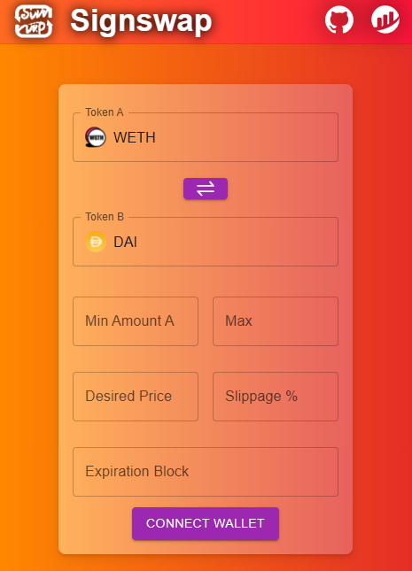

# Signswap - Gasless Swap Protocol

This project is a proof of concept for a DeFi protocol using cryptographic signatures to provide a potentially completely gas-free swap experience to DApp users.



Swaps are not guaranteed to execute, but if they do, they are guaranteed to execute at the price and conditions specified by the user.
The user never pays the fees for execution, they are paid by the protocol.
Currently, fees must be paid for token spending approval.
Gasless approval will be implemented in the future (EIP-2612 permit).

The core of the protocol is the **matching trades execution smart contract** OrderBookExchange.sol
The contract swaps two users tokens atomically **if and only if** the swaps are realized under the conditions specified by the users. To guarantee this, the contract checks the cryptographic signatures associated with the orders.
This signature is issued by the user's wallet, and covers all the parameters of the trade (amount, price, slippage, expiration, etc.).

These signed trade orders are stored on the backend of the protocol, and an engine tries to match them to one another. If a match is found, the contract is called to execute the trade.
If no match is found before the expiration of the order, the order is discarded, as nothing can be done with it.

The code is articulated in 3 main parts:
- The Solidity smart contracts, which is the core of the protocol, in the `contracts` folder. Forge is used to test and deploy the contracts.
- The UI, which is a React app, in the `ui` folder. It is where users interact with the protocol.
- The backend, which is a Node.js app, in the `api` folder. It is where the orders are stored and matched.

TODO:
- User Interface: 
    - [ ] Auto-approve
    - [ ] Icons
    - [ ] Token metadata integration
    - [ ] Price base inversion
    - [ ] Token balance display
    - [ ] Token USD value
    - [ ] Current block number
    - [ ] Plain target duration text
    - [ ] Display slippage price equivalent
    - [ ] Switch bips to pct
- [ ] Contract signature formatting to EIP-712
- [ ] Add gasless approval for compatible tokens (EIP-2612 permit)
- [ ] More thorough fuzz tests
- [ ] Add a fee mechanism to the protocol
- [ ] Multiple order aggregation
- [ ] Upgradeable contracts, with guaranteed revocation of old orders
- [ ] In-house matchmaker engine
- [ ] Add execution time estimation engine for potential orders. Use current active orders, 

# Running the code

## Smart contracts
The smart contracts are written in solidity.

### Pre-requisites
To build the smart contracts and to deploy them, you need to install [Foundry](https://book.getfoundry.sh/) which is a modern Rust-based smart contract development framework.
To install **Foundry**, you need to install it by running the following command in Bash, Git Bash, or WSL (for Windows users):

```bash
curl -L https://foundry.paradigm.xyz | bash
```

You will then to initialize the smart contract project by running the following command:

```bash
forge init --force
forge install openzeppelin/openzeppelin-contracts
```

### Testing
To test the smart contracts, you need to run the following command:

```bash
forge test -vv
```
Forge will automatically run every test file in the `tests` folder (test files must be named `*.t.sol`).

### Deployment
A deployment script has been made. When run, it compiles, tests and deploys the exchange smart contract to the designated chain.
Before running the script, you need to set the following environment variables in an `.env` file located in the `contracts` folder:
```bash
UI_PORT=3000
API_PORT=3090
API_URL=http://localhost
NODE_RPC_URL=http://127.0.0.1:8545 # Address pointed to by the alias 'local' in foundry commands (foundry.toml)
EOA_PRIVATE_KEY=0x... # Private key of the account that will deploy the smart contract (needs to be properly funded)
```
The deployment script will also set the correct environment variables for the UI and the API (`./ui/.env` and `./api/.env` files respectively).
To access these files, `foundry.toml` sets access to all files in `C:/`. This should be changed to `/` for Linux users.

To deploy the smart contract locally, first run the local node using the following command:

```bash
anvil
```

Then, in another terminal, open the `contracts` folder and run the following command to deploy the smart contract:

```bash
forge script script/Deploy.s.sol:DeployScript --rpc-url local --broadcast -vv 
```
Note that this script works for mainnet deployment as well, you simply need to change

For testing purposes, another script has been made that deploys 2 mock ERC20s. It funds 2 specified addresses with some tokens so that they can trade between each other. These addresses could for example be 2 test accounts that are handled by your prefered wallet (Metamask, etc.).
It also funds these addresses with some ETH so that they can pay for gas fees for the approval transactions.
Please note that this script assumes you're using one of the default accounts of your local node (that should come with 1000 ETH with Anvil).
To use it, run the following:

```bash
forge script script/DeployTokens.s.sol:DeployTokens --rpc-url local --broadcast -vv 
```

## Backend API

This App uses Node.js and Express.js to run a backend API that stores and matches orders. It receives the cryptographically signed orders from the UI, stores them in a database, and tries to match them to one another. When it finds a match, it calls the smart contract to execute the trade.
To run the API, you need to install Node.js and npm. Then, in the `api` folder, run the following command to install the dependencies:

```bash
npm install
```

Then, to run the API, run the following command:
```bash
node server.js
```
The transactions sent by the API are signed by the EOA private key specified in the `.env` file. The deployment script sets this variable to the private key of the account that deployed the smart contract.

## UI

This App comes with a React.js UI that allows users to interact with the protocol. It allows them to create orders, in conjunction with an injected web3 wallet (such as Metamask).
To run the UI, you need to install Node.js and npm. Then, in the `ui` folder, run the following command to install the dependencies:

```bash
npm install
```

Then, to run the UI, run the following command:
```bash
npm start
```
The parameters of the swap order can now be filled in. They are:
- Token addresses (ERC20). Input token and desired output token.
- Min input amount and max input amount.
- Price (output/input, eg WETH=>DAI is 1950/1)
- Slippage in basis points bp (1bp = 0.01%, 150bp = 1.5%)
- Expiration block number (need to check current block).

When the user has specified the parameters of the swap, he must make sure that the exchange contract has been approved an allowance of input token at least equal to the **max input amount**. This can be done by clicking the "Approve" button. This will trigger a transaction in the wallet, which will ask the user to sign it. The transaction will be sent to the blockchain, and the allowance will be set. In the future, this will only require a free signature (EIP-2612 permit).
Finally the user can submit the order to sign it, and send it to the API. The API will store it in the database, and try to match it to other orders. If a match is found, the API will call the smart contract to execute the trade.